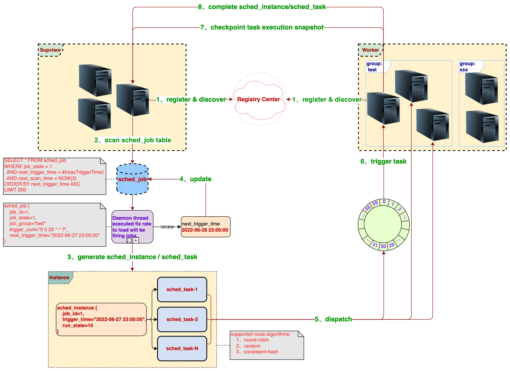

<p align="center">
  
</p>
<p align="center">
  <strong>A distributed task scheduling and distributed computing framework</strong>
</p>
<p align="center">
  <a href="https://www.apache.org/licenses/LICENSE-2.0.html"></a>
  <a href="https://www.oracle.com/java/technologies/downloads/#java8"></a>
  <a href="https://central.sonatype.com/namespace/cn.ponfee"></a>
  <a href="https://github.com/dromara/disjob/actions"></a>
  <a href="http://ponfee.cn:8000/"></a>
</p>
<p align="center">
  online demo：<a href="http://ponfee.cn:8000/">http://ponfee.cn:8000/</a>
</p>

---

**`English`** | [简体中文](README.md)

A distributed task scheduling and distributed computing framework, in addition to having regular task scheduling functions, also provides: pausing/cancelling running tasks, resuming paused tasks, task splitting, failure retries, broadcast tasks, task dependencies, workflow tasks (DAG), separate deployment of managers and executors, Web management backend, and other capabilities.

Lightweight, easy to use, especially suitable for long task execution. It has good scalability, extensibility, and stability, and has been tested in production.

## Architecture

- Overall Process



- Code Structure

```text
disjob                                        # Main project①
├── disjob-admin                              # Management backend project② (Based on RuoYi framework secondary development)
├── disjob-bom                                # Maven project bom module
├── disjob-common                             # Common utility class module
├── disjob-core                               # Task scheduling related core classes (such as data models, enumeration classes, abstract layer interfaces, etc.)
├── disjob-dispatch                           # Task dispatch module
│   ├── disjob-dispatch-api                   # Abstract interface layer of task dispatch
│   ├── disjob-dispatch-http                  # Http implementation of task dispatch
│   └── disjob-dispatch-redis                 # Redis implementation of task dispatch
├── disjob-id                                 # Distributed ID generation module
├── disjob-registry                           # Server (Supervisor & Worker) registration module
│   ├── disjob-registry-api                   # Abstract interface layer of Server registration center
│   ├── disjob-registry-consul                # Server registry center: Consul implementation
│   ├── disjob-registry-database              # Server registry center: Database implementation
│   ├── disjob-registry-etcd                  # Server registry center: Etcd implementation
│   ├── disjob-registry-nacos                 # Server registry center: Nacos implementation
│   ├── disjob-registry-redis                 # Server registry center: Redis implementation
│   └── disjob-registry-zookeeper             # Server registry center: Zookeeper implementation
├── disjob-reports                            # Aggregate test coverage reports of various modules
├── disjob-samples                            # Samples project③
│   ├── disjob-samples-frameless-worker       # Example of Worker deployed separately (ordinary Java-main application)
│   ├── disjob-samples-springboot-common      # Samples Spring-boot common module
│   ├── disjob-samples-springboot-merged      # Example of Supervisor and Worker deployed together (Spring-boot application)
│   ├── disjob-samples-springboot-supervisor  # Example of Supervisor deployed separately (Spring-boot application)
│   └── disjob-samples-springboot-worker      # Example of Worker deployed separately (Spring-boot application)
├── disjob-supervisor                         # Supervisor code
├── disjob-test                               # Used for auxiliary testing
└── disjob-worker                             # Worker code
```

## Features

- Divided into two roles: Manager (Supervisor) and Executor (Worker), Supervisor and Worker can be deployed separately
- Supervisor and Worker discover each other through the registry center, supported: Database, Redis, Consul, Nacos, Zookeeper, Etcd
- Supervisor is responsible for generating tasks and dispatching them to Worker for execution, supported: Redis, Http
- Need to specify the group, Job tasks will only be dispatched to the specified group of Workers for execution
- Provides the ability to split tasks, override the method [JobHandler#split](disjob-core/src/main/java/cn/ponfee/disjob/core/handle/JobSplitter.java) to split many tasks, then distributed and parallel execution
- Supports pausing and cancelling running tasks, paused tasks can be resumed for execution, failed tasks support retry
- Supports savepoint task execution snapshot, so that manually or abnormally paused tasks can be resumed from the savepoint
- If a task throw [PauseTaskException](disjob-core/src/main/java/cn/ponfee/disjob/core/exception/PauseTaskException.java) at executing, then will pause all instance tasks (even if dispatched other worker machine tasks)
- Supports broadcast tasks, broadcast tasks will be dispatched to all workers under the group for execution
- Supports dependencies jobs, multiple Jobs configured with dependencies will be executed in the established dependency order
- Supports DAG workflows, can configure jobHandler as a complex DAG expression, such as: A->B,C,(D->E)->D,F->G
- Provides a Web management backend, job configuration, task monitoring, etc.

## [Download From Maven Central](https://central.sonatype.com/namespace/cn.ponfee)

```xml
<dependency>
  <groupId>cn.ponfee</groupId>
  <artifactId>disjob-{xxx}</artifactId>
  <version>2.1.0</version>
</dependency>
```

## Build From Source

```shell
./mvnw clean install -DskipTests -Dcheckstyle.skip=true -Dmaven.javadoc.skip=true -U
```

## Quick Start

1. Import the projects to IDE (three independent projects all in one `git` repository)

- Primary project: [disjob](pom.xml)
- Admin project: [disjob-admin](disjob-admin/pom.xml)
- Sample project: [disjob-samples](disjob-samples/pom.xml)

2. Start the following applications to form a distributed scheduling cluster

> Configured different ports, run the java main class in IDE, or run the built jar package with the `java -jar` command.

- [Start the embedded local Mysql & Redis](disjob-test/src/main/java/cn/ponfee/disjob/test/EmbeddedMysqlAndRedisServer.java)
    - Refer to this document if reports MariaDB "[Library not loaded](disjob-test/src/main/DB/MariaDB/MariaDB.md)" error on MacOSX
    - When connecting to mysql with a client tool, the username is `root`, no password is required
    - The initialization SQL script has been automatically executed at startup
- [Start the Worker Java-main application](disjob-samples/disjob-samples-frameless-worker/src/main/java/cn/ponfee/disjob/samples/worker/WorkerFramelessMain.java)
- [Start the Worker Spring-boot application](disjob-samples/disjob-samples-springboot-worker/src/main/java/cn/ponfee/disjob/samples/worker/WorkerApplication.java)
- [Start the Supervisor+Worker Spring-boot application](disjob-samples/disjob-samples-springboot-merged/src/main/java/cn/ponfee/disjob/samples/merged/MergedApplication.java)
- [Start the Supervisor Spring-boot application](disjob-samples/disjob-samples-springboot-supervisor/src/main/java/cn/ponfee/disjob/samples/supervisor/SupervisorApplication.java)
- [Start the Admin Spring-boot application](disjob-admin/ruoyi-admin/src/main/java/com/ruoyi/DisjobAdminApplication.java)

3. Login to the Admin

- Open【 http://127.0.0.1:80/ 】in your browser and login with username/password: `admin`/`123456`
- Find the Scheduling Management menu in the left sidebar to use the `scheduling management` function
- Scheduling Configuration: Job configuration, including viewing, adding, modifying, deleting, triggering, disabling, etc.
- Scheduling Instances: job trigger time generate an instance, the instance split to many tasks.

4. Link Address
- Admin demo:【 http://ponfee.cn:8000/ 】, username/password: `disjob`/`123456`
- Online documentation: **Under construction, please stay tuned!**

## User Guide

1. The project includes two SQL scripts

- [Core framework SQL script](sql/mysql-disjob.sql)
- [Admin console SQL script](sql/mysql-disjob_admin.sql)

2. Change the specific implementation of `disjob-registry-{xxx}` and `disjob-dispatch-{xxx}` in the maven pom file

- [Samples project](disjob-samples/pom.xml)
- [Admin project](disjob-admin/ruoyi-disjob/pom.xml)
- By default, `disjob-registry-redis` is used as the server registry and `disjob-dispatch-http` is used for task dispatch

3. Samples project configuration files

- [Supervisor role Mysql configuration](disjob-samples/conf-supervisor/application-mysql.yml)
- [Supervisor role core configuration](disjob-samples/conf-supervisor/application-supervisor.yml)
- [Worker role core configuration](disjob-samples/conf-worker/application-worker.yml)
- [Redis configuration](disjob-samples/disjob-samples-springboot-common/src/main/resources/application-redis.yml)
- [Spring-boot Web configuration](disjob-samples/disjob-samples-springboot-common/src/main/resources/application-web.yml)
- [Worker Java-main application configuration](disjob-samples/disjob-samples-frameless-worker/src/main/resources/worker-conf.yml)

4. Admin project configuration files
- [Supervisor role related Mysql configuration](disjob-admin/ruoyi-disjob/src/main/resources/application-disjob-mysql.yml)
- [Redis configuration](disjob-admin/ruoyi-disjob/src/main/resources/application-disjob-redis.yml)
- [Enable Worker role with @EnableWorker annotation](disjob-admin/ruoyi-disjob/src/main/java/cn/ponfee/disjob/admin/DisjobAdminConfiguration.java)
- [Admin Mysql configuration](disjob-admin/ruoyi-admin/src/main/resources/application-druid.yml)
- [RuoYi framework configuration](http://doc.ruoyi.vip/ruoyi/document/hjbs.html#%E5%BF%85%E8%A6%81%E9%85%8D%E7%BD%AE )

5. Reference for various registry configuration classes (Redis uses the configuration method provided by Spring-boot)
- [Consul](disjob-registry/disjob-registry-consul/src/main/java/cn/ponfee/disjob/registry/consul/configuration/ConsulRegistryProperties.java)
- [Database](disjob-registry/disjob-registry-database/src/main/java/cn/ponfee/disjob/registry/database/configuration/DatabaseRegistryProperties.java)
- [Zookeeper](disjob-registry/disjob-registry-zookeeper/src/main/java/cn/ponfee/disjob/registry/zookeeper/configuration/ZookeeperRegistryProperties.java)
- [Nacos](disjob-registry/disjob-registry-nacos/src/main/java/cn/ponfee/disjob/registry/nacos/configuration/NacosRegistryProperties.java)
- [Etcd](disjob-registry/disjob-registry-etcd/src/main/java/cn/ponfee/disjob/registry/etcd/configuration/EtcdRegistryProperties.java)

> For example, if using Consul as the registry center, you can add the following configuration

```yaml
disjob.registry.consul:
  namespace: disjob_registry
  host: localhost
  port: 8500
  token:
```

6. Some embedded local servers
- [Mysql Server](disjob-test/src/main/java/cn/ponfee/disjob/test/db/EmbeddedMysqlServerMariaDB.java)
- [Redis Server](disjob-test/src/main/java/cn/ponfee/disjob/test/redis/EmbeddedRedisServerKstyrc.java)
- [Zookeeper Server](disjob-registry/disjob-registry-zookeeper/src/test/java/cn/ponfee/disjob/registry/zookeeper/EmbeddedZookeeperServer.java)
- [Consul Server](disjob-registry/disjob-registry-consul/src/test/java/cn/ponfee/disjob/registry/consul/EmbeddedConsulServerPszymczyk.java)
- [Nacos Server](disjob-registry/disjob-registry-nacos/src/test/java/cn/ponfee/disjob/registry/nacos/EmbeddedNacosServerTestcontainers.java)
- [Etcd Server](disjob-registry/disjob-registry-etcd/src/test/java/cn/ponfee/disjob/registry/etcd/EmbeddedEtcdServerTestcontainers.java)

## Contributing

If you find bugs, have better implementation solutions, new features and so on, you can submit a PR or create new[Issues](../../issues)

## Communication

Scan the QR code to add WeChat friends, note `disjob`, and invite you to join the group WeChat.


## Todo List

- [x] Extend registry: Zookeeper, Etcd, Nacos
- [x] Workflow tasks (DAG)
- [x] Admin console: accounting, authority, permission and task manage
- [ ] Build a project document web site
- [ ] Monitor real-time executing logs of tasks online
- [ ] Alarm subscribe: Email, SMS, Voice, Lark, Ding Talk, WeChat
- [ ] Visual monitoring BI dashboard
- [ ] Support more Savepoint implementation: File System, Hadoop, RocksDB, OSS
