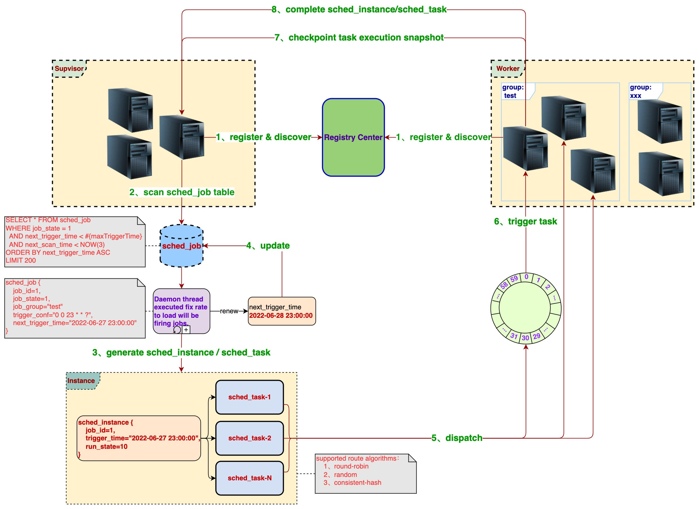

[](http://www.ponfee.cn)
[](https://www.apache.org/licenses/LICENSE-2.0.html)
[](https://www.oracle.com/java/technologies/downloads/#java8)
[](https://github.com/ponfee/distributed-scheduler/actions)
[](https://central.sonatype.com/namespace/cn.ponfee)

**`简体中文`** | [English](README.en.md)

# Distributed Scheduler

## Introduction

一个分布式的任务调度框架，除了具备常规的分布式任务调度功能外，还提供自定义子任务的拆分、可对执行中的长任务自由控制、任务依赖、管理器与执行器分离部署等能力。

轻量级，简单易用，特别适合长任务的执行。有较好的伸缩性，扩展性，稳定性，历经生产检验。

## Architecture

- 架构图



- 工程结构

```Plain Text
distributed-scheduler                                        # 主项目
├── scheduler-common                                         # 工具包
├── scheduler-core                                           # 任务调度相关的核心类（如数据模型、枚举类、抽象层接口等）
├── scheduler-dispatch                                       # 任务分发模块
│   ├── scheduler-dispatch-api                               # 任务分发的抽象接口层
│   ├── scheduler-dispatch-http                              # 任务分发的Http实现
│   └── scheduler-dispatch-redis                             # 任务分发的Redis实现
├── scheduler-registry                                       # Server(Supervisor & Worker)注册模块
│   ├── scheduler-registry-api                               # Server注册的抽象接口层
│   ├── scheduler-registry-consul                            # Server注册的Consul实现
│   ├── scheduler-registry-etcd                              # Server注册的Etcd实现
│   ├── scheduler-registry-nacos                             # Server注册的Nacos实现
│   ├── scheduler-registry-redis                             # Server注册的Redis实现
│   └── scheduler-registry-zookeeper                         # Server注册的Zookeeper实现
├── scheduler-reports                                        # 聚合各个模块的测试覆盖率报告
├── scheduler-samples                                        # Samples项目
│   ├── scheduler-samples-common                             # 存放使用范例中用到的公共代码，包括使用到的一些公共配置文件等
│   ├── scheduler-samples-merged                             # Supervisor与Worker合并部署的范例（Spring boot应用）
│   └── scheduler-samples-separately                         # Supervisor与Worker分离部署的范例模块
│       ├── scheduler-samples-separately-supervisor          # Supervisor单独部署的范例（Spring boot应用）
│       ├── scheduler-samples-separately-worker-frameless    # Worker单独部署的范例（非Spring-boot应用，直接main方法启动）
│       └── scheduler-samples-separately-worker-springboot   # Worker单独部署的范例（Spring boot应用）
├── scheduler-supervisor                                     # Supervisor代码（Spring-boot应用，需要引导Spring扫描该包目录）
├── scheduler-test                                           # 用于辅助测试
└── scheduler-worker                                         # Worker代码
```

## Features

- 分为管理器(Supervisor)和执行器(Worker)两种角色，Supervisor与Worker可分离部署
- Supervisor与Worker通过注册中心解耦，目前支持的注册中心有：Redis、Consul、Nacos、Zookeeper、Etcd
- Supervisor以任务分发方式把任务给到Worker，目前支持的任务分发方式有：Redis、Http
- 支持任务分组(job-group)，任务会分发给指定组的Worker执行
- 自定义拆分任务，重写[JobHandler#split](scheduler-core/src/main/java/cn/ponfee/scheduler/core/handle/JobSplitter.java)即可把一个大任务拆分为多个小任务，任务分治
- 提供任务执行快照的自动保存(checkpoint)，让执行信息不丢失，保证因异常中断的任务能得到继续执行
- 提供执行中的任务控制能力，可随时暂停/取消正在执行中的任务，亦可恢复执行被暂停的任务
- 提供任务依赖执行的能力，多个任务构建好依赖关系后，任务便按既定的依赖顺序依次执行

## [Download From Maven Central](https://central.sonatype.com/namespace/cn.ponfee)

> **注意**: 最近 [aliyun](https://developer.aliyun.com/mvn/search) 那边的镜像仓受Maven中央仓库网络限制，部分依赖可能会从中央仓库同步文件失败，如果依赖查找不到(即无法下载)请在`settings.xml`文件中删除aliyun mirror的配置(不建议使用aliyun maven mirror)

```xml
<dependency>
  <groupId>cn.ponfee</groupId>
  <artifactId>scheduler-{xxx}</artifactId>
  <version>1.10</version>
</dependency>
```

## Build From Source

```bash
./mvnw clean install -DskipTests -Dcheckstyle.skip=true -U
```

## Quick Start

0. IDE分别导入项目(分为两个独立的项目，共用一个Git仓库)：
  - [主项目](pom.xml)
  - [samples项目](scheduler-samples/pom.xml)

1. 运行仓库代码提供的SQL脚本，创建数据库表：[db-script/JOB_TABLES_DDL.sql](db-script/JOB_TABLES_DDL.sql)(也可直接运行[内置mysql-server](scheduler-samples/scheduler-samples-common/src/test/java/cn/ponfee/scheduler/samples/MysqlAndRedisServerStarter.java)，启动时会自动初始化SQL脚本)

2. 修改[Mysql](scheduler-samples/conf-supervisor/application-mysql.yml)、[Redis](scheduler-samples/scheduler-samples-common/src/main/resources/application-redis.yml)、[Consul](scheduler-samples/scheduler-samples-common/src/main/resources/application-consul.yml)等配置文件
  - 如果使用默认的本地配置([如consul localhost 8500](scheduler-registry/scheduler-registry-consul/src/main/java/cn/ponfee/scheduler/registry/consul/configuration/ConsulRegistryProperties.java))，可无需添加对应的resource配置文件(包括Nacos、Zookeeper、Etcd等)
  - 非Spring-boot的Worker应用的配置文件为[worker-conf.yml](scheduler-samples/scheduler-samples-separately/scheduler-samples-separately-worker-frameless/src/main/resources/worker-conf.yml)

3. 编写自己的任务处理器[PrimeCountJobHandler](scheduler-samples/scheduler-samples-common/src/main/java/cn/ponfee/scheduler/samples/common/handler/PrimeCountJobHandler.java)，并继承[JobHandler](scheduler-core/src/main/java/cn/ponfee/scheduler/core/handle/JobHandler.java)

4. 启动[samples项目](scheduler-samples)下的各应用，包括：

```Plain Text
 1）scheduler-samples-merged                        # Supervisor与Worker合并部署的Spring boot应用
 2）scheduler-samples-separately-supervisor         # Supervisor单独部署的Spring boot应用
 3）scheduler-samples-separately-worker-springboot  # Worker单独部署的Spring boot应用
 4）scheduler-samples-separately-worker-frameless   # Worker单独部署(非Spring-boot应用)，直接运行Main方法启动
```

- 已配置不同端口，可同时启动(多个Server组成分布式集群调度环境)
- 可以在开发工具中运行启动类，也可直接运行构建好的jar包
- 注册中心及分发任务的具体实现：在[pom文件](scheduler-samples/scheduler-samples-common/pom.xml)中引入指定的依赖即可
- 项目已内置一些本地启动的server(部分要依赖本地docker环境)
  - [内置redis-server](scheduler-test/src/main/java/cn/ponfee/scheduler/test/redis/EmbeddedRedisServerKstyrc.java)
  - [内置consul-server](scheduler-registry/scheduler-registry-consul/src/test/java/cn/ponfee/scheduler/registry/consul/EmbeddedConsulServerPszymczyk.java)
  - [内置nacos-server](scheduler-registry/scheduler-registry-nacos/src/test/java/cn/ponfee/scheduler/registry/nacos/EmbeddedNacosServerTestcontainers.java)
  - [内置etcd-server](scheduler-registry/scheduler-registry-etcd/src/test/java/cn/ponfee/scheduler/registry/etcd/EmbeddedEtcdServerTestcontainers.java)
  - [内置zookeeper-server](scheduler-registry/scheduler-registry-zookeeper/src/test/java/cn/ponfee/scheduler/registry/zookeeper/EmbeddedZookeeperServer.java)

```java
@EnableSupervisor
@EnableWorker
public class MergedApplication extends AbstractSamplesApplication {
  public static void main(String[] args) {
    SpringApplication.run(MergedApplication.class, args);
  }
}
```

5. 执行以下curl命令添加任务(任选一台运行中的Supervisor应用替换`localhost:8081`)
  - `triggerValue`修改为大于当前时间的日期值以便即将触发(如当前时间点的下一分钟)
  - `jobHandler`为刚编写的任务处理器类的全限定名（也支持直接贴源代码）

```bash
curl --location --request POST 'http://localhost:8081/api/job/add' \
--header 'Content-Type: application/json' \
--data-raw '{
    "jobGroup": "default",
    "jobName": "prime counter",
    "jobHandler": "cn.ponfee.scheduler.samples.common.handler.PrimeCountJobHandler",
    "jobState": 1,
    "jobParam": "{\"m\":1,\"n\":6000000000,\"blockSize\":100000000,\"parallel\":7}",
    "triggerType": 2,
    "triggerValue": "2022-10-06 12:00:00"
}'
```

6. 查询库表验证任务是否添加成功，以及可查看任务的执行信息：

```sql
-- 刚CURL添加的任务会落入该表中
SELECT * FROM sched_job;

-- 查看任务的执行信息
SELECT * from sched_instance;
SELECT * from sched_task;

-- 可执行以下SQL让该JOB再次触发执行
UPDATE sched_job SET job_state=1, misfire_strategy=3, last_trigger_time=NULL, next_trigger_time=1664944641000 WHERE job_name='PrimeCountJobHandler';
```

- 也可执行以下CURL命令手动触发执行一次(任选一台运行中的Supervisor替换`localhost:8081`，jobId替换为待触发执行的job)

```bash
curl --location --request POST 'http://localhost:8081/api/job/trigger?jobId=4236701614080' \
--header 'Content-Type: application/json'
```

## Contributing

如有发现bug、更优的实现方案、新特性等，可提交PR或新建[Issues](../../issues)。

## Todo List

- [x] Worker提供任务校验及拆分的Http接口供Supervisor调用（[WorkerServiceProvider](scheduler-worker/src/main/java/cn/ponfee/scheduler/worker/rpc/WorkerServiceProvider.java)）
- [x] 扩展注册中心：Zookeeper、Etcd、Nacos
- [ ] 任务管理后台Web UI、账户体系及权限控制、可视化监控BI
- [ ] 增加多种Checkpoint的支持：File System、Hadoop、RocksDB
