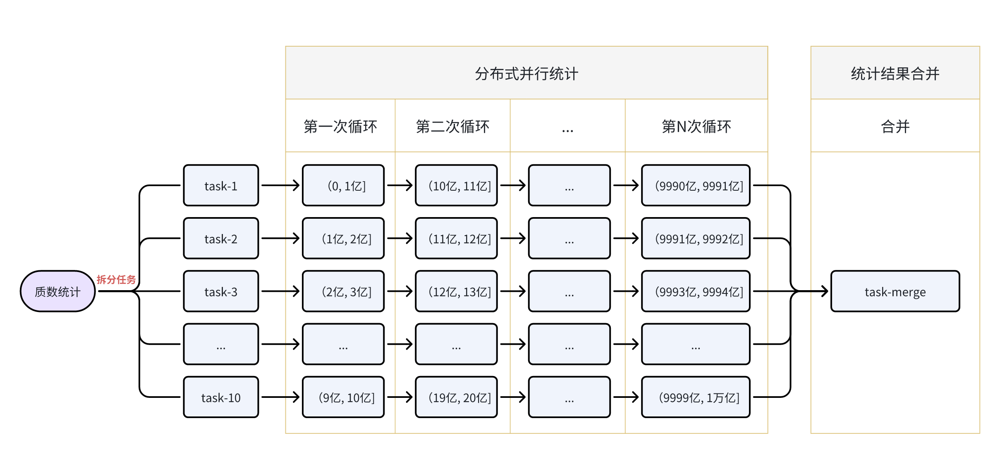

<p align="center">
  
</p>
<p align="center">
  <strong>一款分布式的任务调度与分布式计算框架</strong>
</p>
<p align="center">
  <a href="https://www.apache.org/licenses/LICENSE-2.0.html"></a>
  <a href="https://www.oracle.com/java/technologies/downloads/#java8"></a>
  <a href="https://central.sonatype.com/namespace/cn.ponfee"></a>
  <a href="https://github.com/dromara/disjob/actions"></a>
  <a href="http://ponfee.cn:8000/"></a>
</p>
<p align="center">
  在线演示：<a href="http://ponfee.cn:8000/">http://ponfee.cn:8000/</a>
</p>

---

**`简体中文`** | [English](README.en.md)

一款分布式的任务调度与分布式计算框架，除了具备常规的任务调度功能外，还提供暂停/取消运行中的任务、恢复执行已暂停的任务、任务分片、失败重试、广播任务、任务依赖、工作流任务(DAG)、管理器与执行器分离部署、Web管理后台等能力。

轻量级，简单易用，特别适合长任务的执行。功能强大，稳定可靠，历经生产检验。

## Architecture

- 整体流程


- 代码结构

```text
disjob                                        # 主项目①
├── disjob-admin                              # 管理后台项目②(基于Ruoyi框架二次开发)
├── disjob-bom                                # Maven项目bom模块
├── disjob-common                             # 公共的工具类模块
├── disjob-core                               # 任务调度相关的核心类（如数据模型、枚举类、抽象层接口等）
├── disjob-dispatch                           # 任务派发模块
│   ├── disjob-dispatch-api                   # 任务派发的抽象接口层
│   ├── disjob-dispatch-http                  # 任务派发的Http实现
│   └── disjob-dispatch-redis                 # 任务派发的Redis实现
├── disjob-id                                 # 分布式ID生成模块
├── disjob-registry                           # Server(Supervisor & Worker)注册模块
│   ├── disjob-registry-api                   # Server注册中心的抽象接口层
│   ├── disjob-registry-consul                # Server注册中心：Consul实现
│   ├── disjob-registry-database              # Server注册中心：Database实现
│   ├── disjob-registry-etcd                  # Server注册中心：Etcd实现
│   ├── disjob-registry-nacos                 # Server注册中心：Nacos实现
│   ├── disjob-registry-redis                 # Server注册中心：Redis实现
│   └── disjob-registry-zookeeper             # Server注册中心：Zookeeper实现
├── disjob-reports                            # 聚合各个模块的测试覆盖率报告
├── disjob-samples                            # Samples项目③
│   ├── disjob-samples-conf-common            # Samples公共配置（log4j2.xml）
│   ├── disjob-samples-conf-supervisor        # Samples Supervisor配置
│   ├── disjob-samples-conf-worker            # Samples Worker配置
│   ├── disjob-samples-frameless-worker       # Worker单独部署的范例（普通Java-main应用）
│   ├── disjob-samples-springboot-common      # Samples Spring-boot公共模块
│   ├── disjob-samples-springboot-merged      # Supervisor与Worker合并部署的范例（Spring-boot应用）
│   ├── disjob-samples-springboot-supervisor  # Supervisor单独部署的范例（Spring-boot应用）
│   └── disjob-samples-springboot-worker      # Worker单独部署的范例（Spring-boot应用）
├── disjob-supervisor                         # Supervisor代码
├── disjob-test                               # 用于辅助测试
└── disjob-worker                             # Worker代码
```

## Features

- 分为管理器(Supervisor)和执行器(Worker)两种角色，Supervisor与Worker可分离部署
- Supervisor与Worker通过注册中心相互发现，支持的注册中心有：Database、Redis、Consul、Nacos、Zookeeper、Etcd
- Supervisor负责生成任务，把任务派发给Worker执行，支持的任务派发方式有：Redis、Http
- 需要指定Job的分组(group)，Job的任务只会派发给指定组的Worker执行
- 提供任务分片的能力，重写拆分方法[JobSplitter#split](disjob-worker/src/main/java/cn/ponfee/disjob/worker/executor/JobSplitter.java)即可拆分为多个任务，实现分布式任务及并行执行
- 支持暂停和取消运行中的任务，已暂停的任务可恢复继续执行，执行失败的任务支持重试
- 支持任务保存(Savepoint)其执行状态，让手动或异常暂停的任务能从上一次的执行状态中恢复继续执行
- 任务在执行时若抛出[PauseTaskException](disjob-worker/src/main/java/cn/ponfee/disjob/worker/exception/PauseTaskException.java)，会暂停对应实例下的全部任务(包括分派到其它worker机器的任务)
- 支持广播任务，广播任务会派发给group下的所有worker执行
- 支持Job间的父子依赖，多个Job配置好依赖关系后便会按既定的依赖顺序依次执行
- 支持DAG工作流，可把`jobExecutor`配置为复杂的DAG表达式，如：A->B,C,(D->E)->F,G->H
- 支持执行中的Task在Worker(服务)发布完成后自动恢复继续执行(见`shutdown_strategy`配置)
- 提供Web管理后台，通过用户界面进行作业配置，任务监控等

## Comparison

|                  | **Quartz** | **Elastic-Job** |     **Xxl-Job**      |               **Disjob**               |
| ---------------- | ---------- |-----------------|----------------------|----------------------------------------|
|  **触发类型**     |    Cron    |     Cron        | Cron、固定频率、父子依赖 | Cron、指定时间、固定频率、固定延时、父子依赖 |
|  **任务编排**     |     无     |     无           |     无                | DAG表达式                              |
|  **任务分片**     |     无     |    静态分片       |     广播任务           | 广播任务、动态分片                       |
|  **停止与恢复**    |    无      |     无          | 终止运行中的任务         | 暂停执行中的任务、恢复执行已暂停的任务      |
|  **保存执行快照**  |     无     |     无           |     无                | 有                                    |
|  **失败重试**     |     无     |    失效转移       |     有                | 有                                     |
|  **后台管理**     |     无     |      有          |     有                | 有                                     |
|  **监控告警**     |     无     |      邮件        |     邮件               | 暂无                                   |
|  **查看执行日志**  |     无     |      有          |     有                | 暂无                                   |

## [Download From Maven Central](https://central.sonatype.com/namespace/cn.ponfee)

```xml
<dependency>
  <groupId>cn.ponfee</groupId>
  <artifactId>disjob-{xxx}</artifactId>
  <version>2.1.6</version>
</dependency>
```

## Build From Source

```shell
./mvnw clean install -DskipTests -Dcheckstyle.skip=true -Dmaven.javadoc.skip=true -U
```

## Quick Start

1. 在开发工具中分别导入项目（分为三个独立的项目，共用一个`git`仓库）

- [主项目—disjob](pom.xml)
- [管理后台—disjob-admin](disjob-admin/pom.xml)
- [范例项目—disjob-samples](disjob-samples/pom.xml)

2. 启动以下各应用(执行java main方法)组成分布式调度集群

> 已配置不同的端口可同时启动，可以在开发工具中运行Java main方法，也可通过`java -jar`命令运行构建好的jar包

- [启动内嵌的本地Mysql & Redis](disjob-test/src/main/java/cn/ponfee/disjob/test/EmbeddedMysqlAndRedisServer.java)
  - MacOS系统若报`MariaDB`的“[Library not loaded](disjob-test/src/main/DB/MariaDB/MariaDB.md)”错误时参考
  - 使用客户端工具连接mysql时，用户名为`root`，无需密码
  - 启动时已经自动执行了初始化的SQL脚本
  - 启动失败需要检查下端口是否被占用（mysql端口3306，redis端口6379）
- [启动Worker单独部署的Spring-boot应用](disjob-samples/disjob-samples-springboot-worker/src/main/java/cn/ponfee/disjob/samples/worker/WorkerApplication.java)
- [启动Worker单独部署的普通Java-main应用](disjob-samples/disjob-samples-frameless-worker/src/main/java/cn/ponfee/disjob/samples/worker/WorkerFramelessMain.java)
- [启动Supervisor+Worker合并部署的Spring-boot应用](disjob-samples/disjob-samples-springboot-merged/src/main/java/cn/ponfee/disjob/samples/merged/MergedApplication.java)
- [启动Supervisor单独部署的Spring-boot应用](disjob-samples/disjob-samples-springboot-supervisor/src/main/java/cn/ponfee/disjob/samples/supervisor/SupervisorApplication.java)
- [启动Admin管理后台的Spring-boot应用](disjob-admin/ruoyi-admin/src/main/java/com/ruoyi/DisjobAdminApplication.java)

3. 登录管理后台

- 浏览器访问【 http://127.0.0.1:80/ 】登录管理后台，用户名/密码：`admin`/`123456`
- 登录后在左侧菜单栏找到`调度管理`菜单，即可使用调度管理功能
- **Supervisor**：查看Supervisor机器列表及其运行情况
- **管理分组**：给管理员使用，管理分组(一个分组可理解为是一个应用)
- **我的分组**：给应用的开发人员使用，可查看每个组(应用)的Worker机器列表及其运行情况
- **作业配置**：作业(job)配置，包括查看、新增、修改、删除、触发、禁用等
- **任务实例**：job在某一时间点被触发执行的实例(instance)，一个实例会拆分成若干个任务(task)
  - 在页面上方的`第一个分页表格`是以树状(tree)方式展示任务实例，并支持下钻
  - 鼠标向下滚动页面后看到的`第二个分页表格`是以扁平(flat)方式展示任务实例

4. 链接地址
- 管理后台**演示地址**：【 http://ponfee.cn:8000/ 】，用户名/密码：`disjob`/`123456`
- 在线查看**文档地址**：`正在建设中，敬请期待！`

## User Guide

1. 项目包含两个SQL脚本

- [核心框架的SQL脚本](sql/mysql-disjob.sql)
- [管理后台的SQL脚本](sql/mysql-disjob_admin.sql)

2. 在Maven pom文件中更改`注册中心disjob-registry-{xxx}`和`任务派发disjob-dispatch-{xxx}`的具体实现

- [Samples项目](disjob-samples/pom.xml)
- [Admin项目](disjob-admin/ruoyi-disjob/pom.xml)
- 默认使用`disjob-registry-redis`做注册中心，`disjob-dispatch-http`做任务派发

3. Samples项目配置文件

- [Supervisor角色Mysql配置](disjob-samples/disjob-samples-conf-supervisor/src/main/resources/application-mysql.yml)
- [Supervisor角色核心配置](disjob-samples/disjob-samples-conf-supervisor/src/main/resources/application-supervisor.yml)
- [Worker角色核心配置](disjob-samples/disjob-samples-conf-worker/src/main/resources/application-worker.yml)（Spring-boot应用）
- [Redis配置](disjob-samples/disjob-samples-springboot-common/src/main/resources/application-redis.yml)（Worker与Supervisor共用，使用Redis做注册中心或任务派发时需要配置）
- [Spring-boot Web相关配置](disjob-samples/disjob-samples-springboot-common/src/main/resources/application-web.yml)（Worker与Supervisor共用）
- [Worker角色普通Java-main应用配置](disjob-samples/disjob-samples-frameless-worker/src/main/resources/worker-conf.yml)

4. Admin项目配置文件
- [Supervisor角色相关的Mysql配置](disjob-admin/ruoyi-disjob/src/main/resources/application-disjob-mysql.yml)
- [Redis配置](disjob-admin/ruoyi-disjob/src/main/resources/application-disjob-redis.yml)（Worker与Supervisor共用，使用Redis做注册中心或任务派发时需要配置）
- [可加@EnableWorker注解启用Worker角色](disjob-admin/ruoyi-disjob/src/main/java/cn/ponfee/disjob/admin/DisjobAdminConfiguration.java)（管理后台必须启用Supervisor角色）
- [管理后台功能相关的Mysql配置](disjob-admin/ruoyi-admin/src/main/resources/application-druid.yml)
- [RuoYi框架相关配置参考](http://doc.ruoyi.vip/ruoyi/document/hjbs.html#%E5%BF%85%E8%A6%81%E9%85%8D%E7%BD%AE )（disjob-admin中只新增了[ruoyi-disjob](disjob-admin/ruoyi-disjob)模块，其它RuoYi原有的模块基本没有改动）

5. 各种注册中心配置类参考（Redis使用Spring-boot自带的配置方式）
- [Consul](disjob-registry/disjob-registry-consul/src/main/java/cn/ponfee/disjob/registry/consul/configuration/ConsulRegistryProperties.java)
- [Database](disjob-registry/disjob-registry-database/src/main/java/cn/ponfee/disjob/registry/database/configuration/DatabaseRegistryProperties.java)
- [Zookeeper](disjob-registry/disjob-registry-zookeeper/src/main/java/cn/ponfee/disjob/registry/zookeeper/configuration/ZookeeperRegistryProperties.java)
- [Nacos](disjob-registry/disjob-registry-nacos/src/main/java/cn/ponfee/disjob/registry/nacos/configuration/NacosRegistryProperties.java)
- [Etcd](disjob-registry/disjob-registry-etcd/src/main/java/cn/ponfee/disjob/registry/etcd/configuration/EtcdRegistryProperties.java)

> 例如：若使用Consul做配置中心时，可加如下配置

```yaml
disjob.registry.consul:
  namespace: disjob_registry
  host: localhost
  port: 8500
  token:
```

6. 一些内嵌的本地Server
- [Mysql Server](disjob-test/src/main/java/cn/ponfee/disjob/test/db/EmbeddedMysqlServerMariaDB.java)
- [Redis Server](disjob-test/src/main/java/cn/ponfee/disjob/test/redis/EmbeddedRedisServerKstyrc.java)
- [Zookeeper Server](disjob-registry/disjob-registry-zookeeper/src/test/java/cn/ponfee/disjob/registry/zookeeper/EmbeddedZookeeperServer.java)
- [Consul Server](disjob-registry/disjob-registry-consul/src/test/java/cn/ponfee/disjob/registry/consul/EmbeddedConsulServerPszymczyk.java)
- [Nacos Server](disjob-registry/disjob-registry-nacos/src/test/java/cn/ponfee/disjob/registry/nacos/EmbeddedNacosServerTestcontainers.java)（依赖本地docker环境）
- [Etcd Server](disjob-registry/disjob-registry-etcd/src/test/java/cn/ponfee/disjob/registry/etcd/EmbeddedEtcdServerTestcontainers.java)（依赖本地docker环境）

## Example

举个简单的例子：统计在`(0，1万亿]`区间内质数的个数。如果是单机单线程CPU的话要统计很长时间，这里我们就可以使用本框架提供的分布式计算能力来解决此类问题。

1. **任务分片**

先根据当前的机器资源情况来决定拆分任务的数量，比如我们有5台机器及每台2 core CPU(质数统计是CPU密集型)，决定拆分为10个任务。

2. **派发任务**

Supervisor使用指定的路由算法把拆分的10个子任务派发给这些Worker机器。

3. **接收任务**

Worker接收到子任务后，会提交到框架自定义的线程池中执行。

4. **分布式并行计算**

在执行时我们可以使用分批次方式(通过代码循环)来统计，这里我们指定`task-1`在第一次循环统计`(0, 1亿]`，第二次循环统计`(10亿, 11亿]`，以此类推最后一次循环统计`(9990亿, 9991亿]`。同理其它的task也是按同样的方式分布式并行统计。

> P.s. 黎曼猜想中可知质数分布是大体均匀的，判断一个数是否质数有很多方法，如埃氏筛法、欧拉筛法、Miller Rabin素性检验，这里我们可以使用Guava库提供的素性检验。

5. **Savepoint**

如果在统计过程中机器宕机后怎么办？难道再从头开始统计吗？No No No！我们可以在每循环10次(或每隔执行超过1分钟)时使用`Savepoint`保存当前`task-1`的执行快照。宕机异常后的重新启动任务时会读取这份快照数据，从上一次的状态中接着继续统计。以下是`task-1`任务保存的快照数据样例

```json5
{
  "next": 4000000001, // 下一次循环时要统计的区间为(40亿, 41亿]
  "count": 19819734,  // 已经统计到了 19819734 个质数
  "finished": false   // 当前任务是否已经统计完成：true-是；false-否；
}
```

6. **服务发布**

这些Task正在执行中，假如此时需要重新发布Worker(服务)该怎么办？Don't worry！在Worker发布的过程中无需人工干预，等服务发布完成一段时间后Task会自动恢复继续执行。

7. **暂停与恢复**

假如我们的这几台机器资源需要临时做其它的事情，想把当前的统计任务暂停一段时间。No problem！框架是支持`暂停执行中的任务`，只需要在管理后台的`任务实例`页面，找到该任务点击`暂停`按钮即可。在暂停时任务会接收到一个中断信号，收到中断信号时同样可以在代码中使用`Savepoint`保存当前的执行快照。

当其它事情执行完后，我们可以在管理后台的`任务实例`页面，找到被暂停的这个任务，点击`恢复`按钮，此时任务会从上一次保存的状态中恢复继续执行。

8. **异常中断**

子任务在执行过程中若抛出框架的[PauseTaskException](disjob-worker/src/main/java/cn/ponfee/disjob/worker/exception/PauseTaskException.java)，则会`暂停`对应任务实例下全部的10个子任务(包括派发在不同机器中的任务)。同样如果抛出[CancelTaskException](disjob-worker/src/main/java/cn/ponfee/disjob/worker/exception/CancelTaskException.java)则会`取消`对应任务实例下全部的10个子任务。如果抛出其它类型的异常时，只会`取消`当前子任务，对应任务实例下其它的子任务不受影响。

9. **任务编排**

现在这个质数统计的总任务已经执行完了，共10个子任务，每个子任务都统计出了它的那部分结果。Disjob能自动帮我汇总结果吗？Yes！框架提供了非常强大且方便的表达式来编排任务，如：`A->B,C,(D->E)->F,G->H`，现在我们就可以创建一个汇总任务，然后再把这两个任务编排在一起。

以下是本例质数统计中的job数据，只列了一些主要字段，其中`jobExecutor`编排了这两个任务执行器(见项目源码)

```json5
{
  "group": "app-test",
  "jobName": "prime-count-dag",
  "jobState": 1, // job状态：0-禁用；1-启用；
  "jobType": 2,  // job类型：1-常规；2-工作流(DAG)；
  "jobExecutor": "cn.ponfee.disjob.test.executor.PrimeCountJobExecutor -> cn.ponfee.disjob.test.executor.PrimeAccumulateJobExecutor",
  "jobParam": "{\"m\":1,\"n\":10000000000,\"blockSize\":100000000,\"parallel\":10}",
  "triggerType": 2,
  "triggerValue": "2023-09-02 18:00:00"
}
```

> 本例中的质数统计流程图如下



## Contributing

如有发现bug、更优的实现方案、新特性等，可提交PR或新建[Issues](../../issues)。

## Communication

扫码添加微信好友，备注`disjob`，邀您加入群聊


## TODO List

- [x] 扩展注册中心：Zookeeper、Etcd、Nacos
- [x] 工作流任务(Workflow DAG)
- [x] 管理后台：用户体系、权限控制、调度管理等
- [ ] 搭建一个关于项目使用说明的文档站点
- [ ] 在线查看任务实时运行日志
- [ ] 任务执行异常告警通知：邮件、短信、电话、飞书、钉钉、微信
- [ ] 任务执行情况的可视化监控BI(Dashboard)
